
<!-- _paginate: false -->
​
# BayLIME: Bayesian Local Interpretable Model-Agnostic Explanations

(Zhao et al. 2021)

---

## Explainable AI (XAI)

* research field aiming at improving trust and transparency of AI
* seeks to provide **good explanations** (Ribeiro et al. 2016a,b)
  * *explanation*
    * the answer to a why-question (Miller 2017)
    * relates the feature values of an instance to its model prediction in a humanly understandable way (Molnar 2021)
  * *goodness*
    * **interpretability** = qualitative understanding between the input variables and the response
    * **fidelity** = how truthfully the explanation represents the unknown behaviour underlying AI decision 
    (\+ possibly several other criteria (see e.g. Molnar 2021))

---

## LIME: Local Interpretable Model-agnostic Explanations

* implementation of local surrogate models  (Ribeiro et al. 2016a)
  * **surrogate** = **interpretable** models trained to **approximate** the predictions of the underlying black box model
  * **local** = focuses on training surrogate models to explain **individual** predictions
* **model-agnostic** = can be used for any ML model
* works for all tabular data, text and images 
* most popular XAI method
 

<table>
  <tr>
    <td valign="top">   (Stiglic et al. 2020)</td>
    <td valign="top">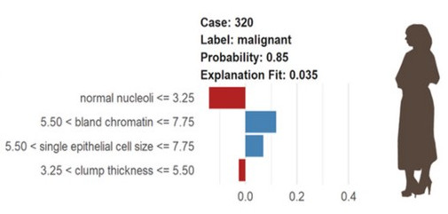</td>
  </tr>
 </table>

 <!-- 
&nbsp;&nbsp;&nbsp;&nbsp;&nbsp;(Stiglic et al. 2020)
-->
 <!--  -->

<!--

  
   
  

-->
---

## LIME: how does it proceed ?

<u>Aim</u>: identify an interpretable model over the interpretable representation that is locally faithful  (Ribeiro et al. 2016b)

<u>For any black-blox model, the procedure in brief</u>:

1. select an **instance of interest**

2. **perturb the dataset**

3.  get **new predictions** from the black-box model for the perturbed samples

4. **weight** the perturbed samples according to their proximity to the instance of interest

5. train a **weighted, interpretable model** on the perturbed dataset 

6. **explain the prediction** by interpreting the local model

 ([Molnar 2021, §5.8](https://christophm.github.io/interpretable-ml-book/lime.html))

---

## LIME: how does it proceed ?

<u>Mathematically speaking...</u>

Obtain the explanation $ξ(x)$ by solving:

$$
ξ(x) = \underset{g∈G}{argmin}\textrm{ }L(f,g,Πx) + Ω(g) 
$$

$G$ = class of potentially interpretable models; $g$ = explanation model; $f$ =model being explained;  $Π_{x}(z)$ = proximity measure; $L(f,g,Πx)$ = fidelity function; $Ω$ = complexity measure

Estimate $L$ by generating perturbed samples around $x$, making predictions with the black box model $f$ and weighting them according to $Π_{x}$  (Ribeiro et al. 2016b)

$\rightarrow$ minimize $L(f,g,Πx)$ while having $Ω(g)$ be low enough &nbsp;
(*fidelity-interpretability trade-off*)

---

## LIME: how does it proceed ?

<u>... and visually speaking</u>

<table>
  <tr>
    <td valign="top" text-align="right"> procedure:</td>
    <td valign="top">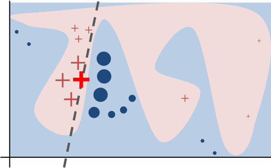</td>
  </tr>
  <tr>
    <td valign="top" text-align="right"> output:</td>
    <td valign="top">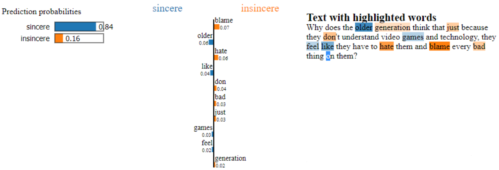</td>
  </tr>
 </table>

<!--

-->

TO CHANGE WITH https://www.oreilly.com/content/introduction-to-local-interpretable-model-agnostic-explanations-lime/

---

## LIME weaknesses

 

* **inconsistency**: different explanations can be generated for the same prediction
  * caused by the randomness in generating perturbed samples that are used for the training of local surrogate models
  * smaller sample size = greater uncertainty 
  * limits its usefulness in critical applications (e.g. medical domain)

******* ADD FIGURE 1

---

## LIME weaknesses

 

* **inconsistency**: different explanations can be generated for the same prediction
  * caused by the randomness in generating perturbed samples that are used for the training of local surrogate models
  * smaller sample size = greater uncertainty 
  * limits its usefulness in critical applications (e.g. medical domain)

* **unrobustness** to kernel settings: challenge of defining the "neighbourhood" of the instance of interest (step 4)
    * no effective way to find the best kernel settings
    * best strategy for now: "trial-error" (biases !)

---
  
## BayeLIME: LIME in a Bayesian way

* Bayesian linear regression framework  
* for $n$ samples $X$ and $m$ features, the **posterior distribution of the mean vector of the coefficient vector $\beta$** is given by:			
$$
 µ_n = (λI_m + αX^TWX)^{−1}λI_mµ_0 +\\(λI_m + αX^TWX)^{−1}αX^TWXβ_{MLE}
$$

  $µ_n$ = the posterior mean vector of $\beta$; $µ_0$  = the prior mean vector of $\beta$; 
  $β$ = the coefficient vector for the features; $β_{MLE}$ = ML estimates for the linear regression model; 
  $α$ = the precision parameter (noise in the linear assumption); $\lambda$ = the precision parameter that governs the prior

$\rightarrow$ a <u>weighted sum of $µ_0$ and $β_{MLE}$</u>: **Bayesian combination of prior knowledge and the new observations**

---
  
## BayeLIME: LIME in a Bayesian way

$$
 µ_n = (λI_m + αX^TWX)^{−1}λI_mµ_0 +\\(λI_m + αX^TWX)^{−1}αX^TWXβ_{MLE}
$$

					

one sample and one feature case:

$$
 µ_n = \frac{\lambda}{\lambda+\alpha w_c n }\mu_0 + \frac{\alpha w_c n}{\lambda + \alpha w_c}\beta_{MLE}
$$

					

$\Rightarrow$ a <u>weighted sum of $µ_0$ and $β_{MLE}$</u> where the weights are proportional to 
  1. $\lambda I_m$= the **"pseudo-count" of prior sample size** ($\lambda$) based on which $µ_{0}$ is formed
   
  2. $αX^TWX$ = the **"accurate-actual-count" of observation sample size**, i.e. the actual observation of the *n* new samples 
  ($X^TWX$) scaled by their precision ($\alpha$)

---
## BayeLIME: procedure recap

1. before the new experiment, form the **prior estimate** of $µ_{0}$ based on $λ$ data points 
 
2. in the experiments, collect *n* new samples and consider their precision ($α$) and weights ($w_{c}$) for forming a **ML estimate** $β_{MLE}$
 
3. **combine $µ_{0}$ and $β_{MLE}$** according to their proportions of the effective samples size ($λ$ and $αw_{c}n$, respectively)
 
4. calculate the **posterior precision** captured by all effective samples (i.e. $λ + αw_{c}n$)

---
## BayeLIME: options for the priors

1. **non-informative** priors
   - $µ_{0}$: zero mean vector 
   - $λ$ and $α$: fitted with Bayesian model selection 

2. **partial informative** priors
   - $µ_{0}$ and $λ$: known distribution
   - $α$: fitted with Bayesian model selection
3. **full informative** priors (ideal scenario)
   - $µ_{0}$, $λ$ and $α$: known distribution

---
  
## BayeLIME: upsides

The combination between prior knowledge and new observations allows BayLIME to address LIME's weaknesses as it

$\rightarrow$ **improves consistency** by averaging out randomness  
$\rightarrow$  **improves robustness** by averaging out effects from kernels 
$\rightarrow$  **improves explanation fidelity** by combining diverse information

METTRE UNE IMAGE -> COMMENT LE PROUVER !! sth like REALLY ? believe
un truc genre voir pour croire saint

---

## Methods: BayeLIME validation

<!--
<ol style="line-height:200%">
<li> <b>consistency</b> improvement (vs. LIME)</li>
<li> <b>robustness</b> to kernel settings improvement (vs. LIME)</li>
<li> explanation <b>fidelity</b> improvement (vs. XAI methods)</li>
</ol>
-->

 

 RQ1. <b>consistency</b> improvement (vs. LIME) 
 RQ2. <b>robustness</b> to kernel settings improvement (vs. LIME) 
 RQ3. explanation <b>fidelity</b> improvement (vs. XAI methods) 

 

<u>Datasets</u>:
* Boston house-price dataset
* breast cancer Wisconsin dataset 
* a set of CNNs pretrained on the ImageNet and GTSRB

---

## Methods: (in)consistency

* **Kendall's W**
  * measure the agreement among raters (here: repeated explanations) 
   
  * ranges from 0 (no agreement) to 1 (complete agreement) 
   
  * cannot discriminate explanations with the same ranking of features but different importance vectors

---

## Methods: (in)consistency

* **Kendall's W** 
 
* new metric **based on the index of dispersion** (IoD) of each feature 
  * a weighted sum of IoD of each feature's ranks in repeated explanations
 
 
---

## Methods: (in)consistency

* **Kendall's W** 
 
* new metric **based on the index of dispersion** (IoD) 
 
* <u>procedure</u>:
    - select a set of BayLIME explainers with **different options and prior parameters**
    - for each, iterate the explanation of the given instance *k* times, and quantify the inconsistency 

---

## Methods: robustness to kernel settings
* <u>procedure</u>:
  * define a kernel width settings interval $[l_{lo}, l_{up}]$ 
   
  * randomly sample from that interval 5000 **pairs of kernel width parameters**
   
  * for each pair, calculate the "distance" of the 2 explanations
   
  * obtain a sample set of ratios between the 2 distances of explanations and the kernel width pair
   
  * its **median value** provides insights on the general robustness
      ($\rightarrow$ weaker empirical global Lipschitz value)
      

---
## Methods: explanation fidelity

* 2 causal metrics
   1. **deletion**: decrease in the probability of the predicted label when starting with a complete instance and then gradually removing top-important features
     - good explanation = sharp drop (low AUC as a function of the fraction of removed features)
   2. **insertion**: increase in the probability as more and more important features are introduced
     - good explanation = higher AUC
      
* neural backdoors
  * blackdoor triggers $\rightarrow$ ground truth
  * metrics: IoU (and AMD)
  
---
## Methods: how to obtain prior knowledge ?

* explanations of a set of **similar instances** (RQ1+RQ2)
  - the average importance of each feature in that set collectively forms the prior mean vector
   
 * **XAI techniques** (RQ3a)
   - explanations obtained from other XAI explainers 
   - here: GradCAM results as priors
   
* **Validation and Verification (V&V) methods** (RQ3b)
   - direct analysis of the behaviour of the underlying AI model
   - e.g. detection tools may provide prior knowledge on possible backdoor triggers
   - here:  NeuralCleanse results as priors

---

## Results: consistency improvement

<!-- 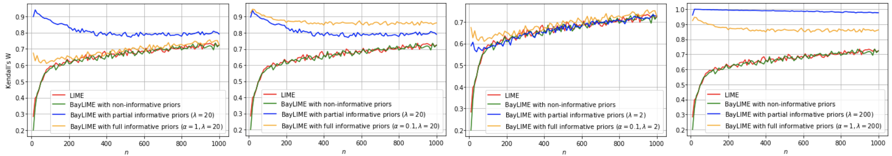 -->

<!-- 

 -->

* non-informative BayLIME indistinguishable from LIME, with monotonic increasing trends as *n* increases 
* by contrast, BayLIME with partial/full informative priors "averages out" the sampling noise
* $\lambda/\alpha$: large (resp. small) value = the prior is dominated by the prior knowledge (resp. new data)
  * when it increases, the ability of averaging out sampling noise is even stronger.  
* when $n → +∞$,  all converge to MLE

---
## Results: robustness to kernel settings improvement

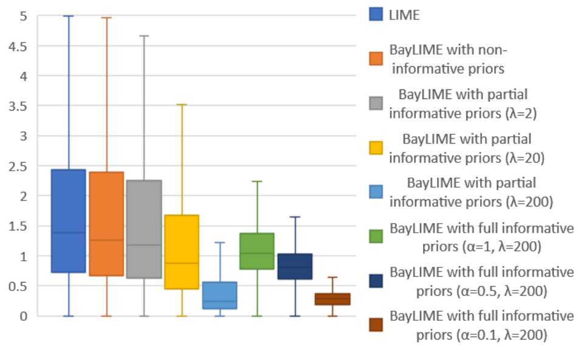

 

* similar (un)robustness for LIME and BayLIME with non-informative priors 
* either partial or full prior knowledge improves robustness 
* increased robustness for large $\lambda/\alpha$

---
## Results: explanation fidelity - XAI methods

* better performance than GradCAM and LIME

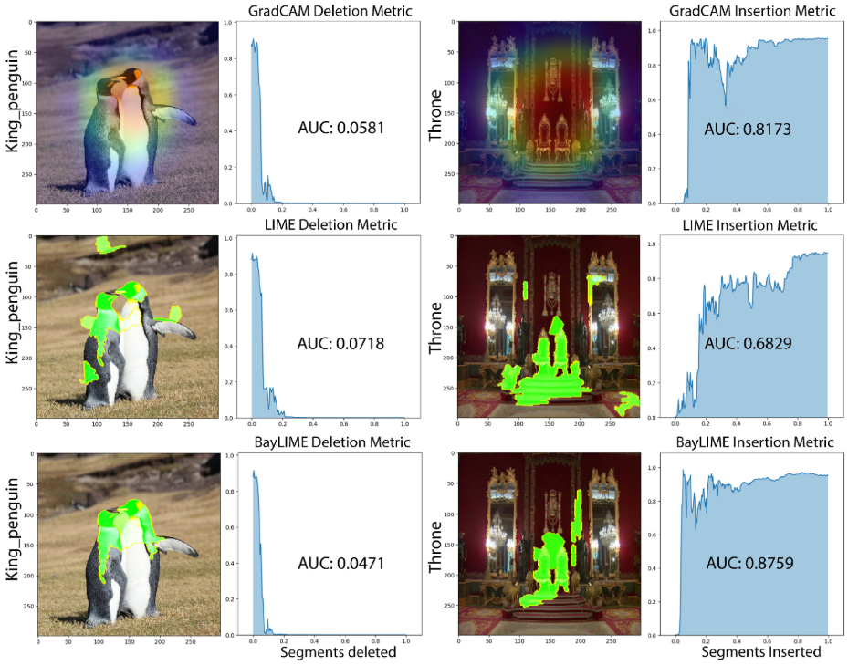

---
## Results: explanation fidelity - XAI methods

* by varying *n* (average scores):
  * better than SHAP and LIME, converging when *n* increases
  * GradCAM better only when *n* is extremely small
  

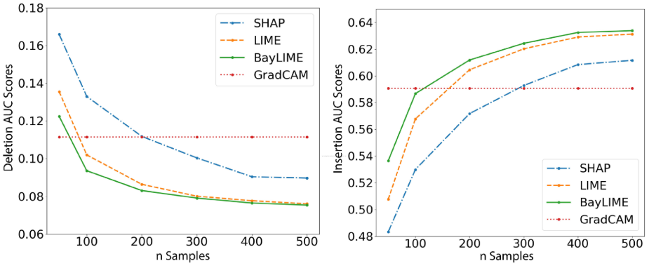

$\Rightarrow$ **better fidelity in the middle and most practical range of *n*** 

---
## Results: explanation fidelity - V&V methods

* NeuralCleanse yields reversed triggers as the approximation of backdoor, which are far from perfect
* even directly apply LIME on an attacked image may provide a better IoU than NeuralCleanse. 

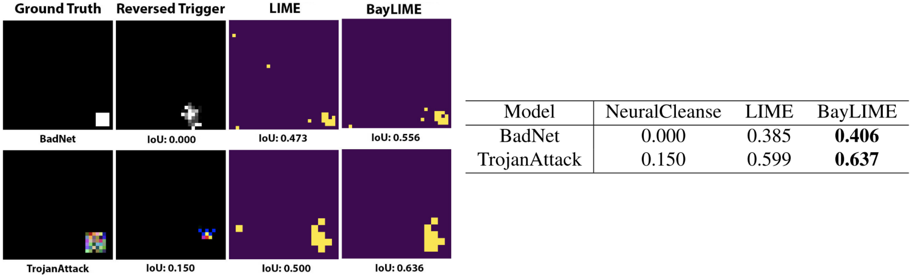

$\Rightarrow$ **better fidelity after considering both the reversed triggers and a surrogate model** 

<!--
---
## Conclusion: uniqueness of BayLIME

* previous attempts for improving LIME  (e.g. modified sampling method, deterministic methods instead of random perturbations, etc.); in comparison, BayLIME:
  * embeds prior knowledge in a Bayesian way
  * can deal with strict efficiency constraints (small $n$)
  * improves explanation fidelity

* two other XAI techniques with Bayesian flavour:
  * using a global approximation, requires large sample size  (Guo et al. 2018)
  * using the posterior credible intervals to determine an ideal sample size $n$  (Slack et al. 2020)

$\Rightarrow$ **BayLIME is the first to exploit prior knowledge for better consistency, robustness to kernel settings and explanation fidelity**
-->

---
## Conclusion 

<u>BayLIME</u>:
* is the first to exploit prior knowledge for better consistency, robustness to kernel settings and explanation fidelity
* improves over LIME
  * the prior knowledge is independent from the causes of inconsistency and unrobustness (thus benefits both properties)
  * improve fidelity by including additional useful information 
* performs better than V&V and other XAI methods

$\Rightarrow$ a way to obtain better explanations of AI models

$\Rightarrow$ a (Bayesian) way to inject knowledge in AI model interpretation (but defining good priors remains challenging !)

---
## Appendix: inconsistency metric

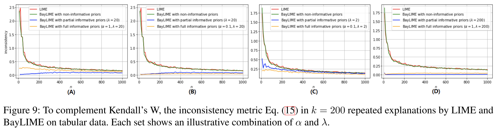

---
## Appendix: inconsist. metric vs. Kendall's W

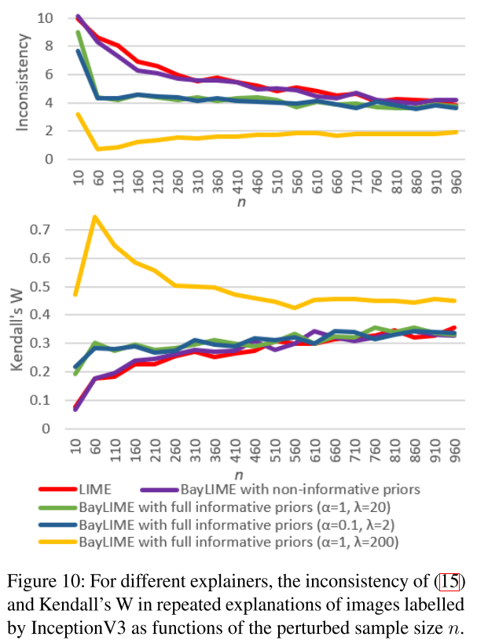

---
## Appendix: IoU vs. AMD

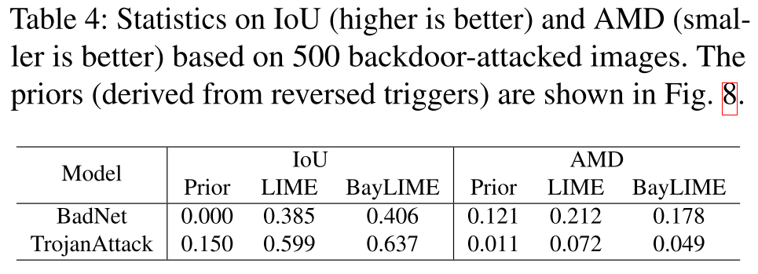

---
## Appendix: 

---
## Appendix: 

---
## Appendix: 

---
## Appendix: 

---
## Appendix: 

---
## Appendix: 
